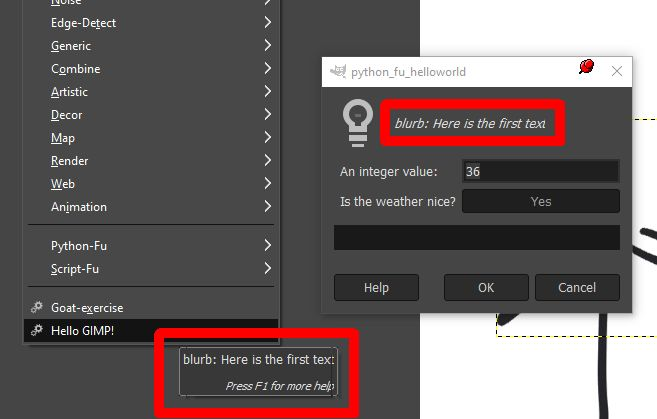
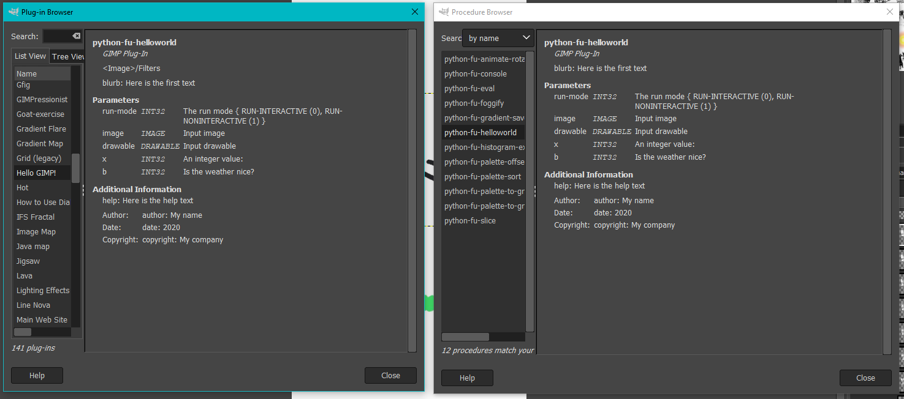
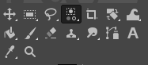
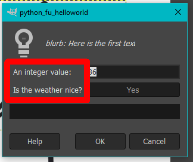
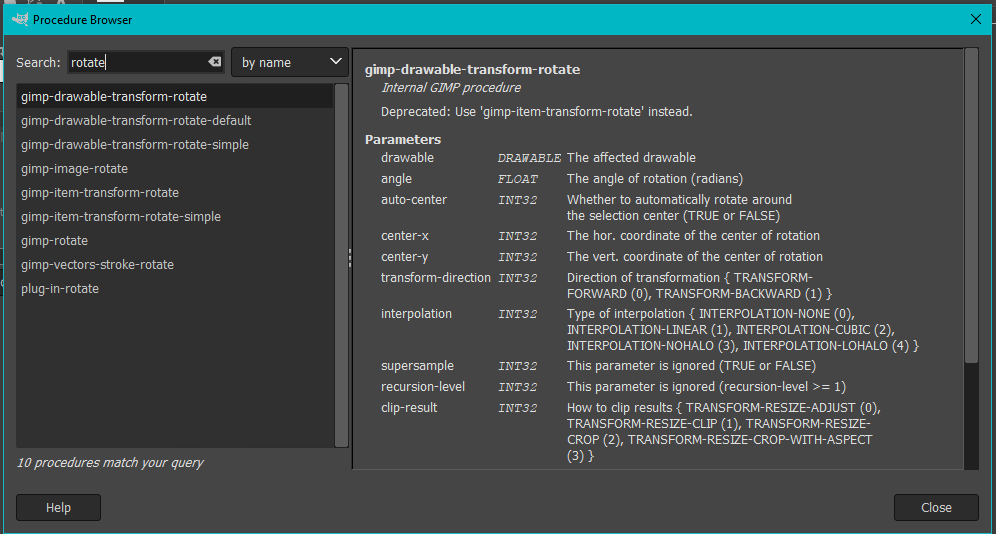

# Writing python plugins for GIMP v2.10

1. [Preface](#preface)
2. [Tutorials on the internet](#tutorials-on-the-internet)
3. [Python Plugin: The Basics](#python-plugin--the-basics)
	+ [The register() function](#the-register---function)
		- [proc_name](#proc-name)
		- [blurb](#blurb)
		- [help, author, copyright, date](#help--author--copyright--date)
		- [label](#label)
		- [imagetypes](#imagetypes)
		- [params, results](#params--results)
		- [function](#function)
	+ [The main callback](#the-main-callback)
		- [GIMP routines](#gimp-routines)
		- [Calling GIMP routines](#calling-gimp-routines)
		- [Duplicating a layer](#duplicating-a-layer)
		- [Putting it all together](#putting-it-all-together)
4. [Performance](#performance)
5. [More sources](#more-sources)

## Preface

In early 2021, I was bored and decided to animate this profile picture that I've been using for some time now:


I wanted the rotors to spin in an animated gif and decided to use GIMP for this task (later someone told me, that something like AE would be more suited).
My idea was to separate the picture into two layers: the backdrop and the rotor. Then I simply needed to clone the rotor layer 360 times and rotate each layer by 1 degree. 
Afterwards, I'd also clone the backdrop 360 times and merge it with each rotated rotor image.

Here is an example with 12 frames made by hand:


And this little ugly thing took me already half an hour.

As there is a lot of work to do, I wanted a script / plugin to do it for me. In my opinion, the beauty of GIMP is that it's so easily extensible and comes with a fair amount of good plugins installed.

## Tutorials on the internet

Now here the trouble starts. I could only find three (good) references on writing GIMP plugins:
 - [Nathan Good: Use Python to write plug-ins for GIMP](https://ibm.com/developerworks/opensource/library/os-autogimp/index.html#resources)
 - [Calinou: InsaneBump GIMP plugin](https://gist.github.com/Calinou/5b9bd428079959558ba8)
 - [An Example Plugin in the GIMP reference](https://gimp.org/docs/python/index.html#STRUCTURE-OF-PLUGIN)

Keep in mind that the third link is for GIMP v1 (which is, funny enough, still from the last millenium).
Also there's [How to write a GIMP plug-in](https://developer.gimp.org/writing-a-plug-in/1/index.html), but this is mostly technical stuff spread over three parts - and it is also for GIMP v1.

GIMP has plug-ins and scripts (the two have separate folders in the configuration). I couldn't find any information on the internet on the difference of these two.
I'll just call them plug-ins from now on. [There are multiple ways to write write plug-ins in GIMP](https://wiki.gimp.org/wiki/Hacking:Plugins#Choosing_a_Language_for_a_GIMP_Plug-in):
 - A Script-Fu script (a Lua-type language)
 - A Python script (using `import gimpfu`)
 - A C library that is compiled using gimptool (using `#include <libgimp/gimp.h>`)

For the sake of simplicity, I chose to use python.

On Windows, the default GIMP installation comes with its own python version. Look in `Program Files\GIMP 2\bin\python.exe`.
From what I can tell, this is just a plain python version (v2.7.18 comes with GIMP 2.10.20) compiled for Windows, that includes the gimpfu libary.
On Linux, the shared Python installation is used. I don't know if there is compatibility for Python 3, as [Python plugin support is completely disabled in Arch Linux](https://git.archlinux.org/svntogit/packages.git/tree/trunk/PKGBUILD?h=packages/gimp#n49).

I just learned about most of the things I'm writing here. The information is *not* double-checked or written in any official Reference or Help. Also keep in mind, that by no means I know much about Python. My examples may contain code that can be considered "bad", I'm just doing this for demonstration purposes.

## Python Plugin: The Basics
A Python *plugin* consists of a single python file that is executable and has `#!/usr/bin/python` in the first line. It must be placed in any of the directories mentioned in GIMP via `Edit > Preferences > Folders > Plug-ins`. It is also possible to add directories using the `+` button in the top left.

### The register() function

The plugin must call the gimpfu.register() function. Help for every provided function can be viewed via the built-in Python Console (`Filters > Python-Fu > Console`) by `import gimpfu` and `help(gimpfu.<function>)`:
```
>>> import gimpfu
>>> help(gimpfu.register)
Help on function register in module gimpfu:

register(proc_name, blurb, help, author, copyright, date, label, imagetypes, params, results, function, menu=None, domain=None, on_query=None, on_run=None)
    This is called to register a new plug-in.
```

This is somewhat helpful. But what is a `blurb`? How should the `params` be specified? What `imagetypes` are there? Etc. etc.

According to [the GIMP reference](https://developer.gimp.org/writing-a-plug-in/1/index.html) (scroll down to "The query() function"), "gimp_install_procedure [which is the C aequivalent to python-fu's register] declares the procedure name, some description and help strings [...]". A paragraph down, there is a list of image types (which might very well be outdated as the article is from 2003).

Even better, [Nathan Good's article](https://ibm.com/developerworks/opensource/library/os-autogimp/index.html#resources) has a table with all parameters.

[The Gimp Python Documentation, Chapter 2.3. Plugin Framework, also has information for the `register()` function.](https://gimp.org/docs/python/index.html#PLUGIN-FRAMEWORK)

This repository contains a basic example using `register()` named `hellogimp.py`.
I've also compiled some more information about the parameters:

#### proc_name
The name of the command / script / plug-in. Keep in mind, that this has to be unique across your entire GIMP installation, so no script should share a name with another script or built-in routine. 

These can conventially be called `"python_fu_<what the script does>"`.

#### blurb


Blurb appears in the tooltip when hovering over the plugin's entry in the menu. Blurb is also at the top of the Dialog that appears before the filter is executed.

#### help, author, copyright, date
These three are very hidden. They don't appear in the normal UI, but can be viewed in either the Procedure Browser or Plugin Browser, both available via the Help menu:

I couldn't find any of those in another place.

#### label
label is an internal value that changes where the plugin can be accessed. Again, there's no real help for the parameters.
So far, I've seen these:
 - The first part in <> specifies which toolbar contains the plugin. So far I've seen:
 	 - `<Image>` the giant toolbar at the top of the main screen.
	 - `<Toolbox>` is the little box at the top left of GIMP's mainscreen: 
	 - `<Palettes>` adds the plugin to the palette (e. g. `palette-offset.py`)
	 - There are plugins that use `<Load>` or `<Save>` but I can't tell where these will be located (e. g. `colorxhtml.py`)
	 - `None` can also be used
 - The rest is a "/"-separated path in the specified toolbar.

My example, `<Image>/Filters/Hello GIMP!`, creates a new entry called `Hello GIMP!` in the Filters tab of the main toolbar.
*The option remains disabled as long as no image is opened.*

#### imagetypes
This again is on the [Gimp developers page](https://developer.gimp.org/writing-a-plug-in/1/index.html) (scroll down to "The query() function"):
There are `RGB`, `INDEXED`, `GRAY`, with and without an added `A` for alpha. `RGBA*, GRAY*` refers to `RGB`, `RGBA`, `GRAY`, `GRAYA`. Please don't ask me what `INDEXED` refers to.

Note that the comma is inside the string: `"RGBA*, GRAY*"`, **not** ~~`"RGBA*", "GRAY*"`~~.

#### params, results
Params are what the user should set in the dialog before running the plugin. Results are what the plugin returns, this is only useful for (internal) routines.

Params an array of quadruplets. Results is an array of triplets. Each tuple has:
1. A type: `PF_INT`, `PF_FLOAT`, `PF_STRING`, `PF_INTARRAY`, `PF_COLOR`, `PF_REGION`, `PF_REGION`, `PF_LAYER`, `PF_TOGGLE`, ...
Many more types are in [Chapter 2.3 of the Gimp Python documentation](https://gimp.org/docs/python/index.html#PLUGIN-FRAMEWORK).
2. A name. I don't know whether it's relevant at all
3. Description: What is displayed in the dialog in front of the selector: 
4. Only for params: A default value. This is what the field will be set to on GIMP launch.

#### function
This is simply the name of the function that GIMP should call when the user clicks OK.

### The main callback
This is the function, GIMP should call when the user clicks OK in the dialog.
It is passed the current image (timg), the current drawable (tdrawable) and all parameters that we defined earlier. All tutorials on the web show that the parameters have to be default-initialized again here (`x=36, b=TRUE`).

In this function, all your stuff happens. Both Python functionality (`print`, loops, calculation, etc.) as well as other GIMP routines can be used.

For the `print` function to output somewhere, [Nathan Good says that GIMP has to be started from the console](https://ibm.com/developerworks/opensource/library/os-autogimp/index.html#resources) (scroll all the way to the end of that section). I tried to start GIMP via PowerShell, but didn't get any output on the print function, maybe this only works under Linux.

#### GIMP routines

The most helpful tool from here on is the Procedure Browser (`Help > Procedure Browser`). You can search for anything in all available procedures.

For my rotate plugin, I first searched for a layer by entering `rotate` into the search box:


The first result is `gimp-drawable-transform-rotate` and variations of it. However, all of them have a deprecation notice, so I had to use `gimp-item-transform-rotate` instead. The difference between it and its `-simple` variant is that the `simple` variant can only rotate by multiples of 90 degrees. The normal version takes an angle in radians instead.

#### Calling GIMP routines

Both [InsaneBump](https://gist.github.com/Calinou/5b9bd428079959558ba8) and [Nathan Good's article](https://ibm.com/developerworks/opensource/library/os-autogimp/index.html#resources) use the `pdb` element to call GIMP procedures and replace dashes `-` by underscores `_`:

```
# Save the image:
pdb.gimp_file_save(image, layer, filename, filename)

# Clone the layer:
newlayer = pdb.gimp_layer_copy (drawable, 1)

# Resize the image:
pdb.gimp_image_scale(timg, newWidth, newHeight)
```
I have no clue why the `-` are replaced with `_`. The `pdb` is included when using `import gimpfu`.

Some functions return multiple values, e. g. `gimp-image-get-layers`. I don't know how these should be handled by the Plugin developer.

Every value required (image, layer, coordinates) are either
1. passed to the plugin_main function (timg, tdrawable)
2. to be selected by the user via a parameter
3. to be calculated by internals of the plugin

#### Duplicating a layer

The second step was to clone the rotor layer. I couldn't find any suiting procedure by searching for either `clone` or `duplicate` in the Procedure Browser, so I copied the functionality from [Calinou's InsaneBump GIMP plugin](https://gist.github.com/Calinou/5b9bd428079959558ba8):
1. Duplicate the layer in GIMP's ram by calling `gimp-layer-copy`.
2. Adding the new layer to the selected image by calling `gimp-image-insert-layer`.

The original example uses `gimp-image-add-layer`, however this function has been deprecated since the introduction of Layer Groups

`gimp-image-insert-layer` takes four parameters:
1. The image (`timg` in the example)
2. The new layer that should be inserted (the one that was returned from `gimp-layer-copy`)
3. The parent layer / the parent of the layer group that this layer should be inserted in. [If the layer shouldn't be in any layer group, simply use `None`.](http://gimpchat.com/viewtopic.php?f=9&t=5709)
4. The position in the layer stack where the layer should be inserted. Starting from the top (0). There are some extra quirks to it that can be read in the Procedure Browser.

#### Putting it all together
So far we have:

1. Obtaining the rotor & backdrop layers by either retrieving them using `gimp-image-get-layer-by-name` or by passing them as parameters:
```
def plugin_main(timg, tdrawable, steps=36, autocenter=TRUE, rotorlayer=None, backdroplayer=None, cx=0, cy=0):
	#rotorlayer = pdb.gimp_image_get_layer_by_name(timg, "rotor")
	#backdroplayer = pdb.gimp_image_get_layer_by_name(timg, "backdrop")
```
2. Duplicating the rotor & backdrop:
```
	mybackdrop = pdb.gimp_layer_copy(backdroplayer, FALSE)
	pdb.gimp_image_insert_layer(timg, mybackdrop, None, 0)
	myrotor = pdb.gimp_layer_copy(rotorlayer, FALSE)
	pdb.gimp_image_insert_layer(timg, myrotor, None, 0)
```
3. Rotate the rotor:
```
	pdb.gimp_item_transform_rotate(myrotor, angle, autocenter, cx, cy)
```
4. Merge rotor & backdrop:
```
	pdb.gimp_image_merge_down(timg, myrotor, 1)
```
5. Repeat this `steps` time:
```
	for x in range(steps-1):
		mybackdrop = pdb.gimp_layer_copy(backdroplayer, FALSE)
		pdb.gimp_image_insert_layer(timg, mybackdrop, None, 0)

		myrotor = pdb.gimp_layer_copy(rotorlayer, FALSE)
		pdb.gimp_image_insert_layer(timg, myrotor, None, 0)
		pdb.gimp_item_transform_rotate(myrotor, (x + 1) * angle, autocenter, cx, cy)

		pdb.gimp_image_merge_down(timg, myrotor, 1)
```

And that's basically it!

## Performance
I first tried to clone the rotor layer, rotate it by some amount, clone the rotated layer and rotate it by the same amount.
However, in my test, I got very bad performance with this.
With just 36 steps, the final xcf was over 6 gigs large and as such slowed down my entire pc.
I thought that there was a memory leak somewhere, C plugins can and *should* use `g_free()` to free things they don't need anymore (layers, brushes, ...), but there is no such thing in the Python version. I guess that the history stack grew too large or something, so I scrapped that idea and instead cloned the initial image over and over.

## More sources
 - [Gimp Python Documentation](https://www.gimp.org/docs/python/index.html)
 - [Nathan Good: Use Python to write plug-ins for GIMP](https://ibm.com/developerworks/opensource/library/os-autogimp/index.html#resources)
 - [Calinou: InsaneBump GIMP plugin](https://gist.github.com/Calinou/5b9bd428079959558ba8)
 - [Gimp Wiki: Hacking:Plugins](https://wiki.gimp.org/wiki/Hacking:Plugins)
 - [Gimp Developers: How to write a GIMP plug-in](https://developer.gimp.org/writing-a-plug-in/1/index.html)
 - [Gimp Docs: Scripting](https://docs.gimp.org/en/gimp-scripting.html)
 - [stackoverflow: GIMP duplicate layer at script-fu console](https://stackoverflow.com/questions/55996224/gimp-duplicate-layer-at-script-fu-console)
